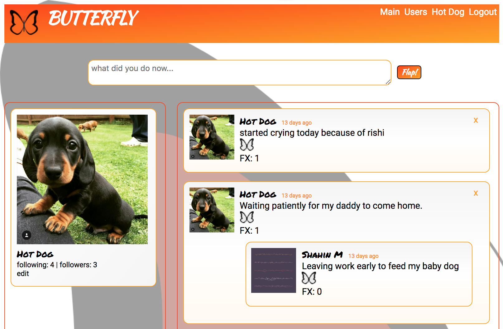

# BUTTERFLY

Rails 5 API backend for BUTTERFLY social messaging application, currently configured for development environment and PostgreSQL development database.  

To get started, clone the repo down, navigate into your clone directory, bundle install, then follow the below instructions to create and migrate the database.

Frontend repo is [here](https://github.com/nspp99b/butterfly-frontend)

[Demo](https://youtu.be/na1Eqad0zHw)

## Ruby version  
2.3.3

## System dependencies  
active_model_serializers  
bcrypt  
jwt  

## Database creation
To get started with a development database:  

rake db: create  
rake db: migrate

Then you're ready to start rails server:  
rails s -p 3001 (recommending 3001 to keep 3000 open for front end).

## Maintenance / Contribution
This is a student project and as such is no longer actively maintained.  

### License

Copyright 2018 [Shahin Motia](https://github.com/nspp99b)

Permission is hereby granted, free of charge, to any person obtaining a copy of this software and associated documentation files (the "Software"), to deal in the Software without restriction, including without limitation the rights to use, copy, modify, merge, publish, distribute, sublicense, and/or sell copies of the Software, and to permit persons to whom the Software is furnished to do so, subject to the following conditions:

The above copyright notice and this permission notice shall be included in all copies or substantial portions of the Software.

THE SOFTWARE IS PROVIDED "AS IS", WITHOUT WARRANTY OF ANY KIND, EXPRESS OR IMPLIED, INCLUDING BUT NOT LIMITED TO THE WARRANTIES OF MERCHANTABILITY, FITNESS FOR A PARTICULAR PURPOSE AND NONINFRINGEMENT. IN NO EVENT SHALL THE AUTHORS OR COPYRIGHT HOLDERS BE LIABLE FOR ANY CLAIM, DAMAGES OR OTHER LIABILITY, WHETHER IN AN ACTION OF CONTRACT, TORT OR OTHERWISE, ARISING FROM, OUT OF OR IN CONNECTION WITH THE SOFTWARE OR THE USE OR OTHER DEALINGS IN THE SOFTWARE.
